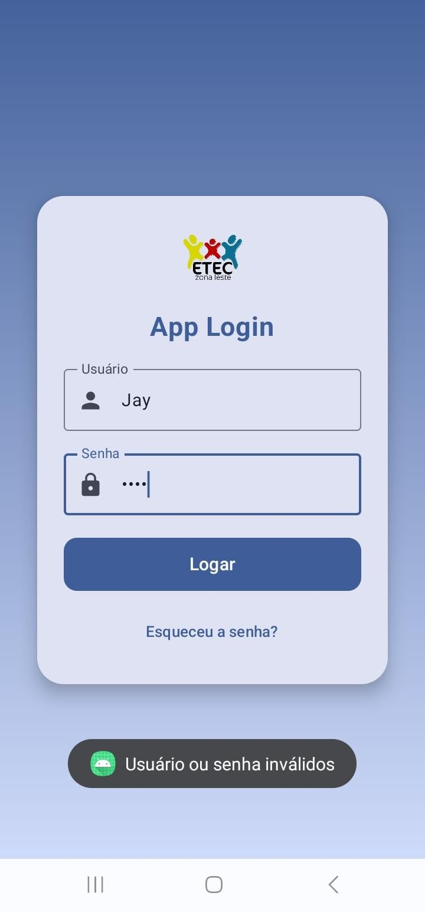
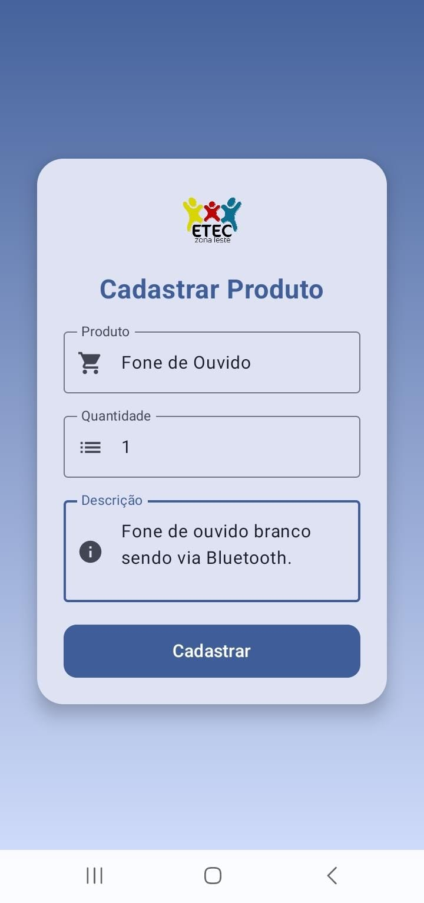
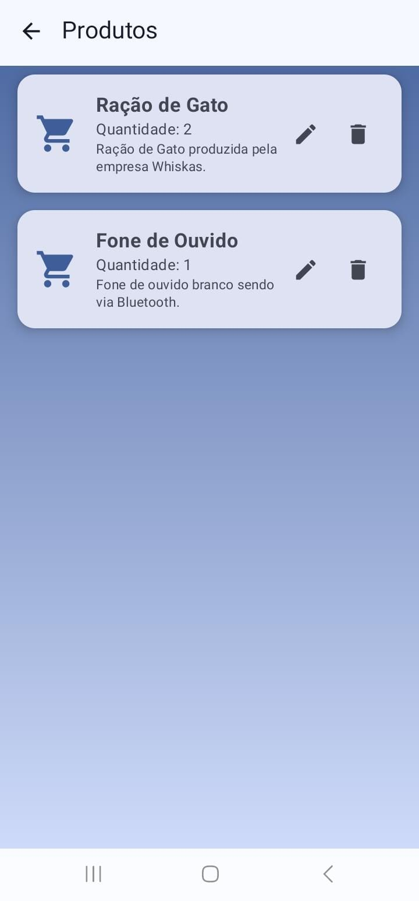

  

<h3 align="center">
  Atividades de 2025 da matéria do curso de Programação de Aplicativos Mobiles.
</h3>
  

---
  
# ★ Telas do Projeto ★

| Tela de Cadastro | Tela de Login (Sucesso) | Tela de Login (Falha) |
|------------------|--------------------------|-------------------------|
|  |  |  |

---

| Tela de Menu | Cadastro de Produto | Listar Produto |
|--------------|---------------------|----------------|
|  |  |  |

---

